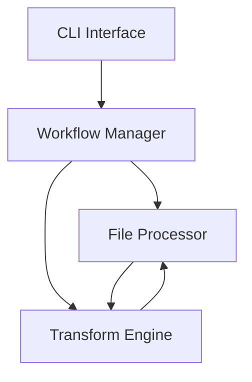

# Local Workflow Manager System Patterns

## System Architecture

### Core Components

1. **CLI Interface**
   - Command-line interface using Commander.js
   - Handles user input and command routing
   - Provides feedback and error reporting

2. **Workflow Manager**
   - Orchestrates the processing pipeline
   - Manages file tracking and state
   - Coordinates between components

3. **File Processor**
   - Handles file I/O operations
   - Supports multiple file formats
   - Manages file paths and directories

4. **Transform Engine**
   - Executes transformation scripts
   - Handles module loading
   - Manages script context and options

### Component Relationships



## Key Technical Decisions

### 1. Project Structure

```
workflow/
  ├── config/
  │   └── workflow.json    # Workflow configuration
  ├── data/
  │   ├── input/          # Input files
  │   └── output/         # Processed files
  ├── scripts/
  │   └── transform.ts    # Transformation logic
  └── wfconfig.js         # Advanced configuration
```

### 2. File Processing Strategy

1. **Input Handling**
   - Files are read from input directory
   - Format is auto-detected
   - Content is parsed appropriately

2. **Processing Flow**
   - Files are processed sequentially
   - Each file goes through configured steps
   - Results are written to output directory

3. **State Management**
   - Processed files are tracked
   - State is persisted between runs
   - Force flag overrides tracking

### 3. Transform Script Architecture

1. **Module System**
   - Supports both CommonJS and ES Modules
   - Auto-detects module type
   - Handles imports appropriately
   - Supports TypeScript and Bun
   - Auto-detects runtime environment

2. **Function Interface**
   ```typescript
   // TypeScript interface
   interface TransformOptions {
     source?: string;
     environment?: string;
     [key: string]: any;
   }

   // TypeScript function
   function transform(content: any, options: TransformOptions): any {
     // transformation logic
     return transformedContent;
   }

   // CommonJS export
   module.exports = { transform };

   // ES Module export
   export { transform };
   ```

3. **Runtime Detection**
   ```typescript
   // Runtime detection in transform script
   const isBun = typeof Bun !== 'undefined';
   const isTypeScript = __filename.endsWith('.ts');

   // Example usage
   if (isBun) {
     // Bun-specific optimizations
   }
   ```

4. **Error Handling**
   - Graceful error recovery
   - Detailed error reporting
   - State preservation on failure

### 4. Configuration Management

1. **Workflow Config**
   ```json
   {
     "name": "workflow-name",
     "steps": [
       {
         "name": "transform",
         "type": "transform",
         "function": "scripts/transform.ts"
       }
     ]
   }
   ```

2. **Options Handling**
   - Hierarchical configuration
   - Environment variable support
   - Command-line overrides

## Design Patterns

### 1. Command Pattern
- Used for CLI commands
- Each command is a separate class
- Common interface for all commands

### 2. Pipeline Pattern
- Processing steps are chained
- Each step transforms data
- Results flow through pipeline

### 3. Factory Pattern
- Creates workflow instances
- Handles configuration loading
- Manages component initialization

### 4. Observer Pattern
- Progress reporting
- Event handling
- State updates

## Error Handling Strategy

1. **Input Validation**
   - Validate configuration
   - Check file existence
   - Verify format compatibility

2. **Processing Errors**
   - Catch and log errors
   - Provide context
   - Allow recovery

3. **System Errors**
   - Graceful degradation
   - State preservation
   - User notification

## Performance Considerations

1. **File Processing**
   - Stream large files
   - Batch processing
   - Memory management

2. **State Management**
   - Efficient tracking
   - Minimal I/O
   - Cache when appropriate

3. **Resource Usage**
   - Control memory usage
   - Manage file handles
   - Clean up resources 